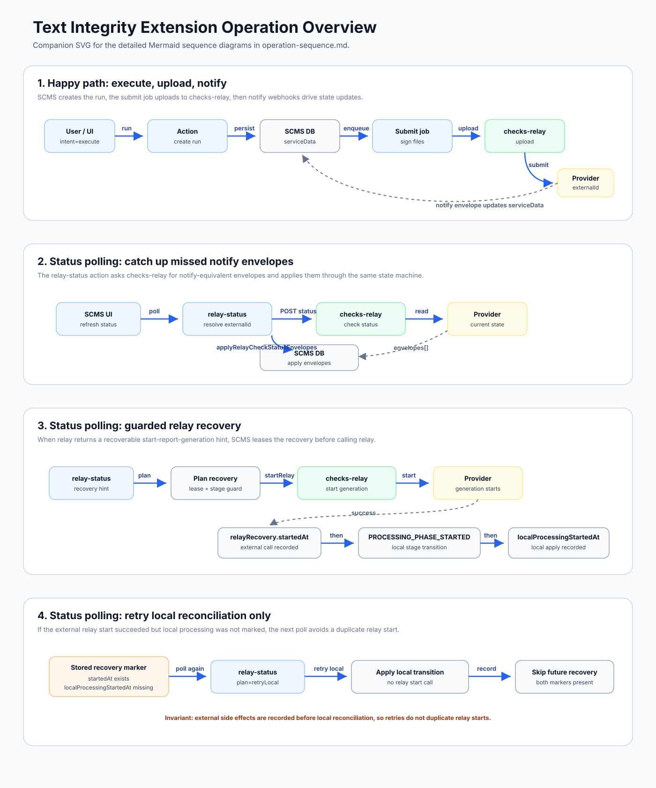
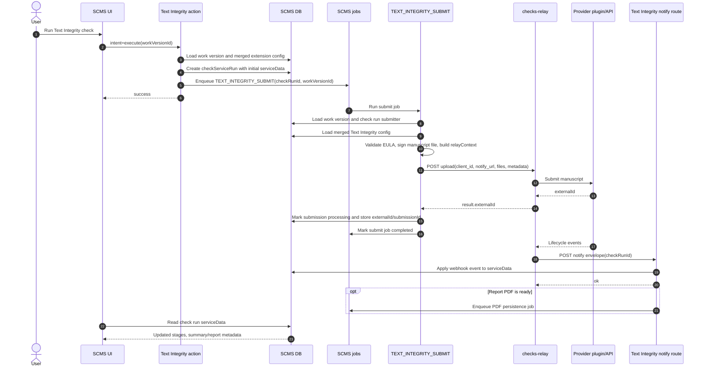
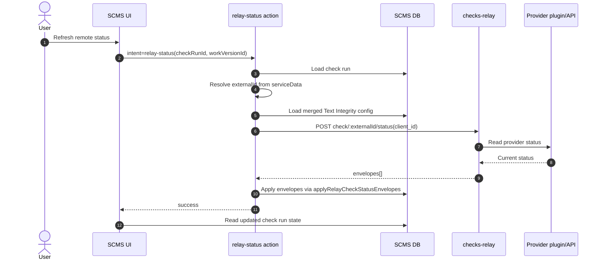
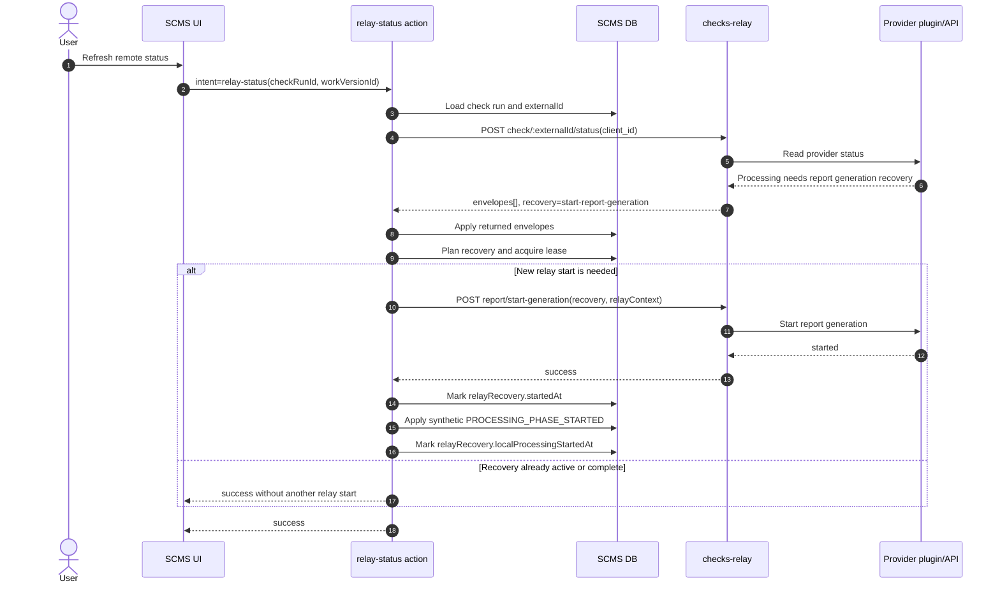
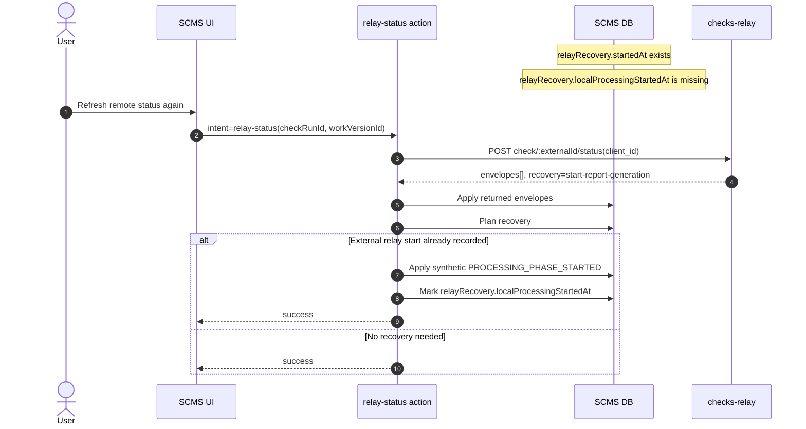

# Text Integrity Operation Sequences

This document summarizes the main runtime flows for the Text Integrity extension.
The extension talks to checks-relay for provider operations and stores normalized
state in the SCMS `checkServiceRun.data.serviceData` object.

## Happy Path

The happy path starts when a user runs the check from SCMS. SCMS creates a check
run, enqueues the submit job, uploads the manuscript to checks-relay, and then
applies provider notify webhooks as they arrive.

Key state transitions:

- `startTextIntegrityCheckRun` creates the run with minimal Text Integrity service data.
- `TEXT_INTEGRITY_SUBMIT` calls checks-relay upload with `client_id` set to the check run id.
- The submit job stores the relay `externalId`, then notify webhooks become the primary source of workflow progress.
- The notify route applies webhook envelopes through the shared state machine.

## Status Polling: Catch Up Missed Notify Events

Status polling is used when SCMS needs to ask checks-relay for the current check
status. This is useful if a notify webhook was delayed, missed, or the UI wants
to refresh state from relay.

In this case, relay only returns notify-equivalent envelopes. The action applies
them through the same state machine used by the webhook route, so polling and
webhooks converge on the same stored `serviceData` shape.

## Status Polling: Recovery Starts Report Generation

Relay status can also include a provider-neutral recovery hint. The extension
uses a local lease to make sure only one SCMS request starts the relay recovery
operation for a check run at a time.

The recovery markers intentionally split external and local state:

- `relayRecovery.startedAt` means the external relay `start-report-generation`
  call succeeded.
- `relayRecovery.localProcessingStartedAt` means SCMS also applied the local
  synthetic `PROCESSING_PHASE_STARTED` transition.

This prevents duplicate relay starts while keeping local state reconciliation
retryable.

## Status Polling: Retry Local Reconciliation Only

If relay start succeeds but SCMS fails while applying the synthetic local
processing transition, a later status poll should not call relay again. It should
retry only the local reconciliation step.

This covers the edge where the external side effect already happened, but the
local processing stage was not advanced. The follow-up poll reuses the existing
lease owner and does not make a second `report/start-generation` call.

## Operational Notes

- Turnitin EULA terms are cached in SCMS and refreshed on a schedule; see [EULA cache refresh cron](./eula-cron.md).
- The check run id is used as `client_id` for relay upload/status calls and as
  the notify route id.
- The notify route and status polling both apply relay notify envelopes through
  the same Text Integrity state machine.
- Status polling requires an `externalId`; before upload completes, polling
  returns an error telling the user to try again after upload.
- Recovery is guarded by both stage state and relay recovery markers:
  processing states `processing`, `completed`, and `notify-skipped` skip
  recovery.
- A live lease blocks concurrent recovery starts. Once the external start is
  recorded, future polls can only retry local reconciliation or skip.
