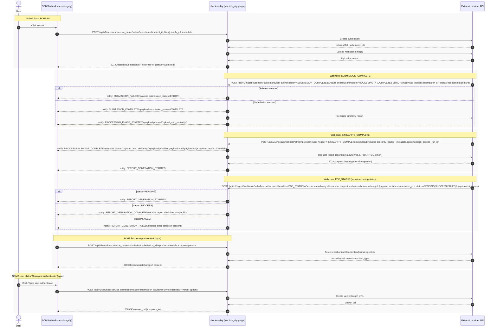

# Text integrity: webhook and notify flow (reference)

This page describes how **SCMS** (this extension), **checks-relay**, and the **external provider** interact for submit, inbound webhooks, and outbound notify callbacks. It is reference material for engineers extending or operating the integration; behavior in production follows the relay plugin and provider contract for your deployment.

**Related:** [Submit relay API](./submit.md)

---

## Sequence diagram

The diagram below is the canonical Mermaid source; a rendered copy may be kept as `webhook.sequence.svg` (regenerate from `webhook.sequence.mmd` when the flow changes).

---

## Endpoints (quick reference)

| Direction | HTTP | Purpose |
|-----------|------|---------|
| SCMS → relay | `POST /api/v1/services/:service_name/submit` | Create submission, upload files, register `notify_url` |
| Provider → relay | `POST /api/v1/ingest/:webhookPathId` | Inbound webhook; relay validates and forwards to SCMS |
| Relay → SCMS | `POST` to `notify_url` from submit | Outbound notify (envelope shape depends on relay version; align SCMS parsing with deployed relay) |
| SCMS → relay | `POST .../submission/:submission_id/report` | Fetch report bytes |
| SCMS → relay | `POST .../submission/:submission_id/viewer-url` | Obtain signed viewer URL |

Path parameter `service_name` is the relay-registered service for this extension (configured as `serviceName` in extension settings).

---

## Webhook event names (logical)

These labels are **logical** event names used in diagrams and extension handling. The wire format (headers, body fields) is defined by the provider; the relay plugin maps inbound requests into relay status and notify payloads.

| Logical event | Typical meaning |
|----------------|-----------------|
| `SUBMISSION_COMPLETE` | Manuscript ingestion finished (success or error) |
| `SIMILARITY_COMPLETE` | Similarity scoring finished |
| `PDF_STATUS` | Report rendering/export status update |

---

## Notify behavior (conceptual)

- Relay may emit **one or more** HTTP callbacks to SCMS per inbound webhook, depending on orchestration (for example, submission outcome plus “processing started”).
- Submit supplies **`notify_url`**; relay persists it with the submission and uses it when processing ingest.
- For credential use on webhook-triggered outbound provider calls, relay must resolve **integration-scoped** secrets (not re-sent on every webhook); see relay configuration and plugin implementation for storage details.

---

## SCMS responsibilities

- Build **`notify_url`** as an absolute URL to the extension’s notify route for the check run (see [submit.md](./submit.md) for the usual pattern).
- Parse notify envelopes consistently with the relay version in use (legacy vs standardized `event` + payload is a common migration point).
- Drive UI from `serviceData` / stage fields updated by notify handling.

---

## Source files

| File | Role |
|------|------|
| `webhook.sequence.mmd` | Mermaid source for tooling / SVG export |
| `webhook.sequence.svg` | Optional static render; regenerate when `.mmd` changes |
